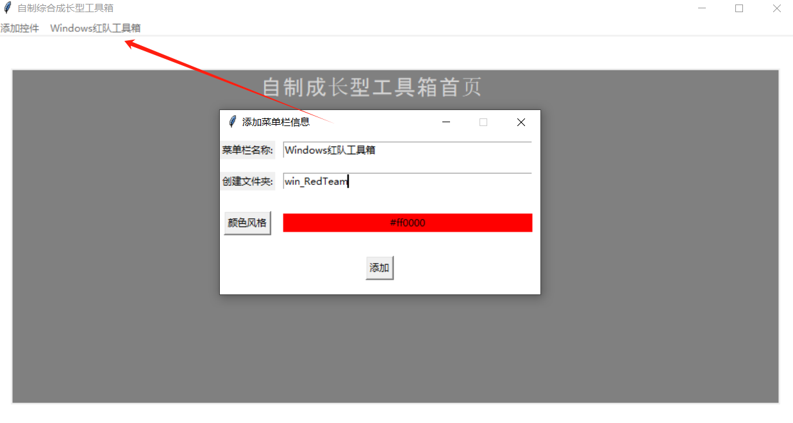
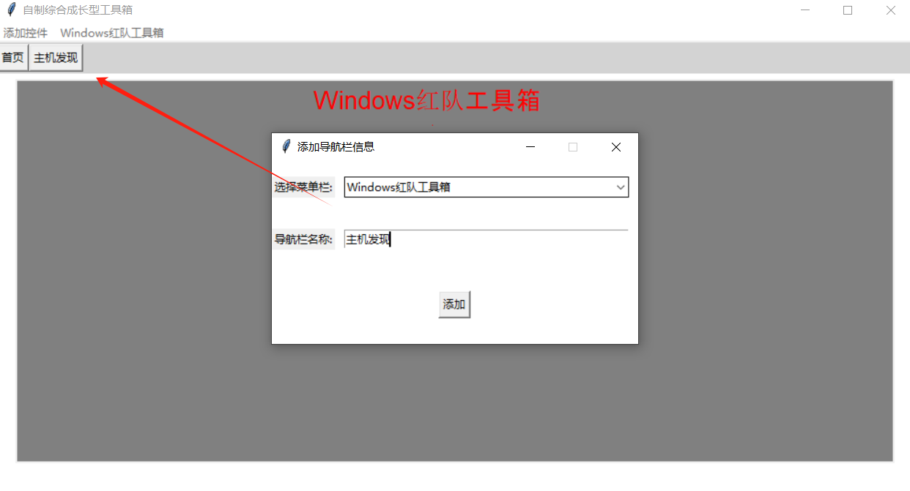
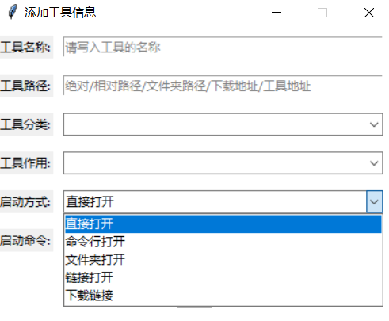
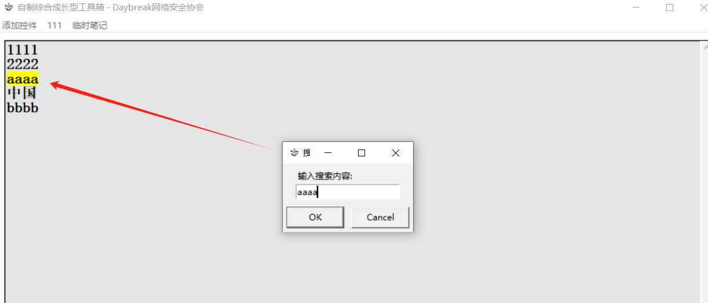
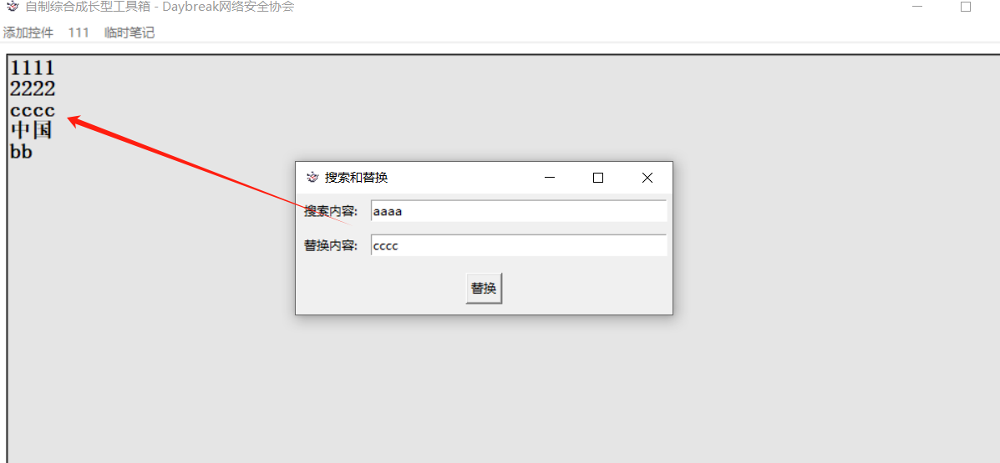
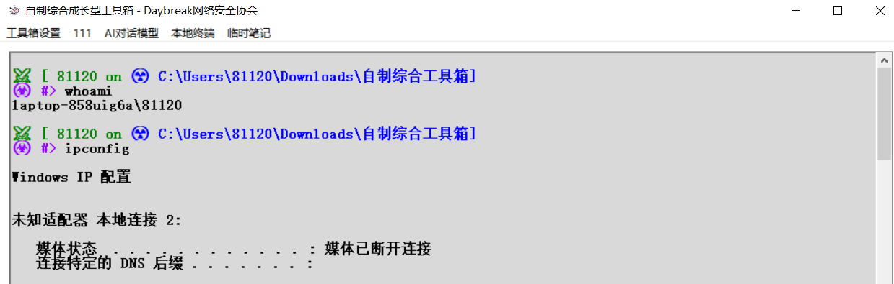
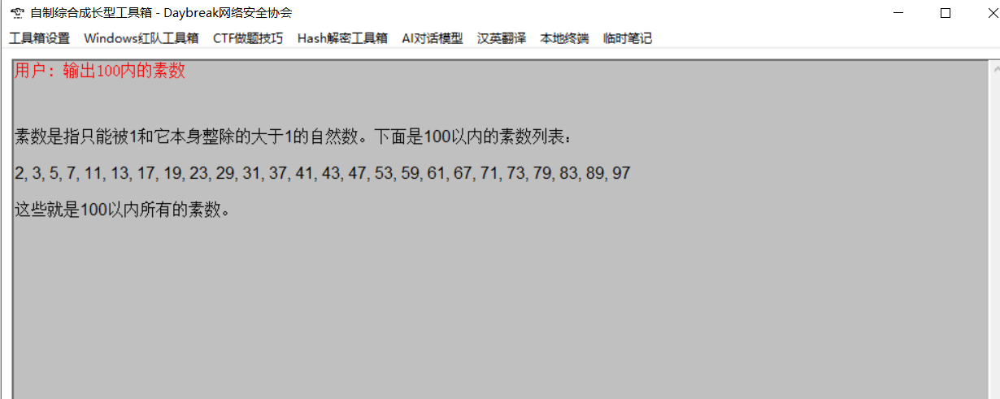

# 综合成长型工具箱

GitHub地址：[Lusensec/Comprehensive_Growth_Toolbox: 综合成长型工具箱 (github.com)](https://github.com/Lusensec/Comprehensive_Growth_Toolbox)

有意愿参加维护项目可在GitHub留言

**更新方法：**我们下载或者克隆项目之后，直接覆盖原有项目即可。每次更新只会修改配置代码，不会对已有工具等配置项发生冲突

# 一、工具箱简介

一、自主定义菜单栏和导航栏。可以伴随用户在从小白到大佬的整学习及使用的过程中不断收集工具，对工具做分类汇总， 让用户对工具变的更加趁手和深入应用。打造属于自己独有的工具箱

二、工具箱具备强大的多种环境应对能力。在面对 Windows、Linux 等以及红队、蓝队等不同的环境下依然能够让用户有工具可用，快速上手工作

三、工具箱具备面对工具的多种情况。根据工具的绝对路径、相对路径以及未安装 等情况做了不同的处理。

1. 绝对路径：适用于本机已经安装且无法移动的工具
2. 相对路径：可以跟随工具箱一起移动，方便备份或者赠与他人
3. 文件夹路径：方便手动启动的工具，可以直接打开工具所处的文件夹，以便应对更加复杂的情况，或zip等工具压缩包，使用时解压等情况
4. 下载地址：方便多数不常用的且占据内存的小工具，只需要把他的下载路径保存下来，可以达到随用随下载，不占据内存
5. 工具地址：某些工具运行在docker 或者其他虚拟机等网页地址，我们可以将其地址写入，点击即可直接用浏览器打开该网页

**在使用前请先下载必要模块**

```
pip3 install -r requests.txt

// start.bat 和 start.sh 是启动程序
```

# 二、自主定义菜单栏、导航栏

## 1、菜单栏

自主添加菜单栏，设置工具分类



这里的`对应文件夹`是方便相对工具的使用而设置，尽量设置成英文名称，防止工具使用出错。

同时，在后面的使用过程中，请把这个菜单栏对应的工具放置在这个文件夹目录下

颜色风格，是为了区分不同菜单栏下的工具而设置，通过颜色辨别

## 2、导航栏

自主添加导航栏，对工具的使用做一个细分



他需要我们在有菜单栏的情况下，在菜单栏下面做一个导航栏，方便对工具的使用做划分

## 3、按钮工具

工具路径上面有说，这里就不在说明。

工具的分类和工具作用分别对应菜单栏和导航栏

重点说明启动方式

### 1、直接打开



方便exe 这种不需要参数即可双击执行的工具。

特别注意：bat的双击脚本推荐使用命令行方式执行

### 2、命令行打开

则是方便 命令行工具，需要有参数才能启动的工具。在设置启动命令的时候，需要用 * 代替工具在命令中的位置，以防因路径问题而出错。

方便跟随工具箱一起移动，做备份或者赠与他人

命令行打开的原理是判断执行的命令中是否具有空格存在，如果命令行中存在空格，则会以命令行的方式运行。因此如果一个exe、bat工具是使用命令执行，可使用【空格*】的方式使用命令行打开，并跟接命令参数

一下是一些常用命令行打开的方式写法

```
// 1、如dirsearch.py 的写法
python * -h

// 2、如命令行打开的exe
 *
// 3、如命令行打开的需要加参数的exe
* -h
// 4、需要双击打开的bat
 *
```

### 3、剩下的打开方式

文件夹打开，就是打开工具所在的文件夹。

链接打开，是适用于网页工具，打开工具所在的网页。

下载链接，上面也有说，会将工具下载下来再使用；注意下载完之后需要右键修改启动命令才能运行打开。

# 三、临时笔记

用于对某些数据的临时记录，当工具箱关闭之后数据将会消失，但是切换菜单栏数据不会消失

同时，现在增加了搜索和替换功能

**搜索：**ctrl + f 启用搜索功能



**替换：**ctrl + h 启动替换功能



# 四、本地shell

可以简单的执行本地命令，但是不能进行彻底的交互式shell（即不能进行mysql连接，以及执行某个文件等）



# 五、ChatAI对话模型

目前只支持kimi 的API ，需要在工具箱设置中配置好kimi 的api 才可以使用

kimi api 的获取方式，可以上网搜一下，有很多，需要到kimi 官网那里获取



在使用之前需要在当前目录下的cmd 中安装 openai 库

```
pip3 install -r requests.txt
或
pip3 install openai
```

# 六、肉鸡面板

需要配置服务端和客户端

## 1、服务端配置

将根目录下的server.py 文件放置服务器中，并执行如下命令即可

```
python3 server.py -lp <端口>
```

## 2、客户端配置

连接IP和端口，分别是服务端的IP和server.py 的启动端口


连接到服务端之后，即可执行后面的生成木马

木马默认为py文件，可以通过提示打包成exe，以及对py文件进行伪装，伪装再后打包成exe

打包的时候可以更改图标和签名等内容需自行研究

## 3、执行命令

当肉鸡上线后，需要右键刷新之后，可以看到上线信息，进入命令后即可在下方执行命令

# 七、其他配置

## 1、设置启动窗口大小


是依据当前的窗口宽度进行实时调整。即优先调整窗口到合适的大小，再去设置窗口大小，会显示当前窗口的大小配置信息，直接填写即可。

是为了方便工具多的情况下导致线条或按钮出格的情况

## 2、工具名称、工具路径修改功能


添加了修改工具名称、工具路径的功能