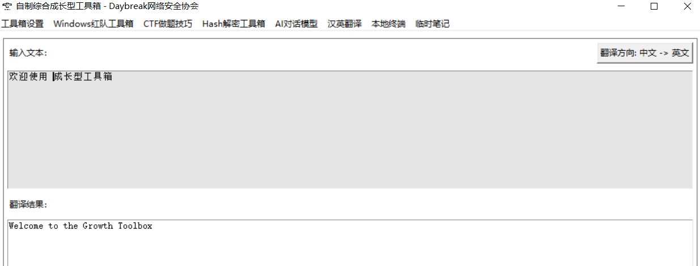

# 自制成长型工具箱

## 零、个人使用




## 一、工具箱简介

一、自主定义菜单栏和导航栏。可以伴随用户在从小白到大佬的整学习及使用的过程中不断收集工具，对工具做分类汇总， 让用户对工具变的更加趁手和深入应用。打造属于自己独有的工具箱

二、工具箱具备强大的多种环境应对能力。在面对 Windows、Linux 等以及红队、蓝队等不同的环境下依然能够让用户有工具可用，快速上手工作

三、工具箱具备面对工具的多种情况。根据工具的绝对路径、相对路径以及未安装 等情况做了不同的处理。

1. 绝对路径：适用于本机已经安装且无法移动的工具
2. 相对路径：可以跟随工具箱一起移动，方便备份或者赠与他人
3. 文件夹路径：方便手动启动的工具，可以直接打开工具所处的文件夹，以便应对更加复杂的情况，或zip等工具压缩包，使用时解压等情况
4. 下载地址：方便多数不常用的且占据内存的小工具，只需要把他的下载路径保存下来，可以达到随用随下载，不占据内存
5. 工具地址：某些工具运行在docker 或者其他虚拟机等网页地址，我们可以将其地址写入，点击即可直接用浏览器打开该网页

**在使用前请先下载必要模块**

```
pip3 install -r requests.txt

// start.bat 和 start.sh 是启动程序
```

## 二、自主定义菜单栏、导航栏

### 1、菜单栏

自主添加菜单栏，设置工具分类


这里的`对应文件夹`是方便相对工具的使用而设置，尽量设置成英文名称，防止工具使用出错。

同时，在后面的使用过程中，请把这个菜单栏对应的工具放置在这个文件夹目录下

颜色风格，是为了区分不同菜单栏下的工具而设置，通过颜色辨别

### 2、导航栏

自主添加导航栏，对工具的使用做一个细分


他需要我们在有菜单栏的情况下，在菜单栏下面做一个导航栏，方便对工具的使用做划分

### 3、按钮工具

工具路径上面有说，这里就不在说明。

工具的分类和工具作用分别对应菜单栏和导航栏

重点说明启动方式

#### 一、直接打开


方便exe 这种不需要参数即可双击执行的工具

#### 二、命令行打开

则是方便 命令行工具，需要有参数才能启动的工具。在设置启动命令的时候，需要用 * 代替工具在命令中的位置，以防因路径问题而出错。

方便跟随工具箱一起移动，做备份或者赠与他人

#### 三、剩下的打开方式

文件夹打开，就是打开工具所在的文件夹

链接打开，是适用于网页工具，打开工具所在的网页

下载链接，上面也有说，会将工具下载下来再使用；注意下载完之后需要右键修改启动命令才能运行打开

## 三、临时笔记

用于对某些数据的临时记录，当工具箱关闭之后数据将会消失，但是切换菜单栏数据不会消失

同时，现在增加了搜索和替换功能

**搜索：**ctrl + f 启用搜索功能


**替换：**ctrl + h 启动替换功能


## 四、本地shell

可以简单的执行本地命令，但是不能进行彻底的交互式shell（即不能进行mysql连接，以及执行某个文件等）


## 五、ChatAI对话模型

目前只支持kimi 的API ，需要在工具箱设置中配置好kimi 的api 才可以使用

kimi api 的获取方式，可以上网搜一下，有很多，需要到kimi 官网那里获取


在使用之前需要在当前目录下的cmd 中安装 openai 库

```
pip3 install -r requests.txt
或
pip3 install openai
```

